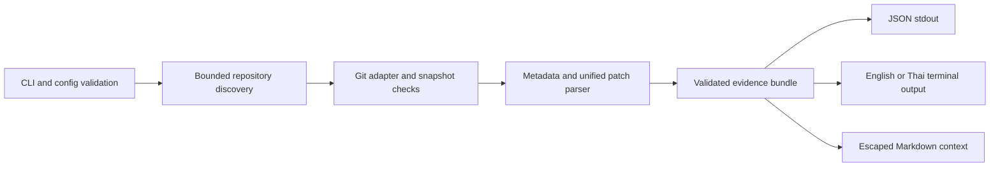

# difflearn v0.1 implementation plan

Planning date: 4 October 2026. Implementation has not started.

## Goal, starting point, and assumptions

Deliver a local, read-only Git evidence CLI for a workspace of roughly 32 repositories: `scan`, `status`, `diff`, JSON `evidence`, and Markdown `context`, with English/Thai human output. The inspected folder contains only `DIFFLEARN_PROJECT_AND_AGENT_PROMPTS.md`; no source, package manifest, `.git`, existing docs, or applicable ancestor `AGENTS.md` was found. The brief supplies product requirements; its embedded implementation prompts are future work, not instructions to execute in this task.

Use one npm package, working name `difflearn`, working binary `dr`, intended MIT license. Names and command collisions remain release checks. Assume Git is installed and local refs may be stale. Windows and Linux are release targets; macOS is initially unverified. No performance promise before measurement. [ADR 0001](adr/0001-evidence-contract.md) is the authoritative command, schema, comparison, and failure contract.

## Architecture and verified technology choices

Compatibility was checked against primary documentation on 4 October 2026. This verifies documented requirements, not an installed or tested dependency combination. Resolve exact patches and commit `package-lock.json` during bootstrap; do not use floating `latest` in the package.

| Choice | Contract and compatibility evidence |
| --- | --- |
| Node 24 LTS | Declare `engines.node: ">=24.20.0 <25"`; test the floor and latest maintained 24.x patch. Node 24 is LTS through April 2028; Node 26 enters LTS on 28 October 2026. [Official schedule](https://github.com/nodejs/Release/blob/main/schedule.json), [release status](https://nodejs.org/en/about/previous-releases). |
| Commander 15.x | Runtime dependency; ESM and bundled declarations, Node >=22.12.0, compatible with Node 24. [Versioned maintainer manifest](https://raw.githubusercontent.com/tj/commander.js/v15.0.0/package.json). |
| Zod 4.x | Runtime dependency for strict config and discriminated evidence schemas; zero external runtime dependencies, Node support, TypeScript >=5.5 with `strict`. [Official requirements](https://zod.dev/), [4.6.0 manifest](https://raw.githubusercontent.com/colinhacks/zod/v4.6.0/packages/zod/package.json). |
| TypeScript 6.0.x, `@types/node` 24.x | Development dependencies. Compiler requires Node >=14.17; Node 24 declarations stay aligned with the supported runtime and have a transitive `undici-types` dependency. Use `strict`, `module`/`moduleResolution: NodeNext`, `target: ES2023`, explicit `types: ["node"]`, separate application/test build configs. [Compiler manifest](https://raw.githubusercontent.com/microsoft/TypeScript/v6.0.2/package.json), [Node 24 declarations](https://raw.githubusercontent.com/DefinitelyTyped/DefinitelyTyped/master/types/node/v24/package.json), [module documentation](https://www.typescriptlang.org/docs/handbook/modules/reference.html). |
| Node built-ins | `child_process.spawn`, filesystem, crypto, `node:test`, and `node:assert/strict`. Compile to JavaScript; no runtime TS loader, bundler, execa, Vitest, glob library, or native Git binding. [Node 24 spawn](https://nodejs.org/download/release/v24.20.0/docs/api/child_process.html), [test runner](https://nodejs.org/docs/latest-v24.x/api/test.html). |
| Git >=2.49 | External prerequisite, not an npm dependency. This floor includes documented lazy-fetch suppression for the no-network contract. Capability-check required options and record actual Git version; test the minimum and a current supported Git, including Git for Windows. [Versioned Git options](https://git-scm.com/docs/git/2.49.0), [diff documentation](https://git-scm.com/docs/git-diff/2.49.0). |

There are two direct runtime and two direct development dependencies. Keep internal modules in `src/{cli,config,git,diff,evidence,output}`. Publish compiled ESM with a shebang entrypoint, `bin: {"dr":"dist/cli/main.js"}`; no public library API promised in v0.1.

## Implementation sequence

Each row is a bounded milestone. Within it, add a focused failing fixture/test, demonstrate the failure, implement, run the named checks, then create a local commit only in an initialized development repository. Commands below are future acceptance commands, not checks run for this planning task. Do not initialize Git or publish as part of planning.

| Step | Files to create or modify | Work and acceptance gate |
| --- | --- | --- |
| 1. Package bootstrap | `package.json`, `package-lock.json`, `tsconfig.json`, `tsconfig.build.json`, `tsconfig.test.json`, `src/cli/main.ts`, `tests/cli.test.ts`, `.gitignore`, `.difflearn.example.json`, `README.md`, `CONTRIBUTING.md`, `LICENSE` | Add help/version and honest unsupported-command errors. Define `build`, `typecheck`, `test`, `verify:package` scripts. Build uses `tsc`; test compiles tests to `.test-dist` and runs explicit test paths with Node, avoiding shell glob assumptions. `npm ci`, `npm run typecheck`, `npm run build`, `npm test`, `node dist/cli/main.js --help`, `node dist/cli/main.js --version` must exit 0. Ignore dependencies, builds, explicit evidence exports, and future state. |
| 2. Config and discovery | `src/config/schema.ts`, `src/config/load.ts`, `src/git/discovery.ts`, `src/git/identity.ts`, `tests/config.test.ts`, `tests/discovery.test.ts`, `tests/helpers/git-fixture.ts` | Implement ADR config/selection/base inputs and `scan`; verify candidates using Git. Fixtures assert root/sibling/nested repositories, gitfiles/worktrees, alias deduplication, excludes, Windows paths, traversal limits, permissions, and submodule boundaries. `npm test` must pass and `scan --json` must parse as one valid report, including partial discovery results. |
| 3. Git adapter, snapshots, status | `src/git/runner.ts`, `src/git/refs.ts`, `src/git/status.ts`, `src/git/snapshot.ts`, `src/git/compare.ts`, `tests/git.test.ts`, `tests/snapshot.test.ts` | Resolve each repository independently; collect branch and XY status separately. Add deterministic flags, process/byte limits, conflict records, input hashing, one retry, and sanitized diagnostics. Assert scope metadata against direct Git, cancellation, missing/unrelated/ambiguous bases, detached/unborn HEAD, and injected races. `status --json` must keep successful repositories when a peer fails. |
| 4. Patch and content evidence | `src/diff/metadata.ts`, `src/diff/patch.ts`, `src/diff/untracked.ts`, `tests/diff.test.ts`, `tests/untracked.test.ts` | Implement `diff` from direct comparisons; join patch sections to NUL metadata without splitting filenames on spaces. Verify ranges, line counts, no-newline markers, renames, binary/mode changes, conflicts, and bounded opt-in untracked content. Fail closed on malformed or unsupported records; no silently dropped hunks. Compare results with real Git-generated fixture patches. |
| 5. Bundle and renderers | `src/evidence/schema.ts`, `src/evidence/identity.ts`, `src/evidence/collect.ts`, `src/output/json.ts`, `src/output/terminal.ts`, `src/output/context.ts`, `src/output/messages.ts`, `tests/evidence.test.ts`, `tests/output.test.ts`, `docs/evidence.schema.json` | Implement `evidence` and `context`; derive published JSON Schema from Zod without a second schema dependency. Validate envelope/kind payloads, links, stable IDs, ordering, coverage, and diagnostics before output. Locale/time/root relocation must preserve identities under the ADR rules. Exercise stdout/stderr and exit codes, escaping, truncation, and broken output streams. |
| 6. Release verification and docs | `tests/package.test.ts`, `scripts/verify-package.mjs`, `.github/workflows/ci.yml`, `examples/synthetic-evidence.json`, `examples/synthetic-context.md`, `CHANGELOG.md`, `README.md`, `CONTRIBUTING.md` | Run the full fixture matrix on Windows/Linux and Node floor/latest. Inspect and install a real tarball, execute the installed binary, and compare its synthetic evidence with the built CLI. Document all limits and unsupported capabilities. Record 32-repository benchmark conditions and measurements. Check package name and binary collision before a future release; no publishing in this milestone. |

## Synthetic Git fixture matrix

Fixtures use temporary directories, fixed authors/dates, controlled Git config, no real code or credentials, and local-only commits/remotes. Use the real Git executable for oracle output and an injectable runner/checkpoint for deterministic failures and races. Recreate fixtures rather than relying on machine-specific OIDs. Disable fixture hooks/filters except deliberate sentinel tests.

| Family | Cases | Required assertions |
| --- | --- | --- |
| Discovery | Root repository, 32 siblings, nested repositories, duplicate aliases, linked worktrees, bare repository, invalid gitfile, inaccessible directory, missing root, no repositories | Stable order and identity; distinct worktree IDs; visible skips/failures; empty successful scan differs from failed traversal. |
| Configuration/base | CLI override across selected repositories, per-repo/default base, origin/custom remote HEAD, missing explicit ref, multiple remote HEADs, tag/OID, unrelated/criss-cross/shallow history | Precedence and provenance; no fallback after an invalid higher-priority choice, no guessing/fetching, explicit ambiguity diagnostics. |
| Scope algebra | Clean, committed-only, staged-only, unstaged-only, staged plus unstaged in one file, staged addition then editing, deletion/recreation, committed/staged/unstaged cancellation | `branch = M..H`, `staged = H..I`, `unstaged = I..W`, `all = M..W`; net changes match direct Git, not concatenation. Working-tree clean does not erase branch changes. |
| HEAD/merge | Detached HEAD, unborn with/without staged files, merge commit, each unmerged stage pattern, resolved merge, rebase state | Nullable HEAD and honest unavailable branch/all; valid unborn staged comparison; conflict stages never ordinary text hunks; ordinary two-tree merge-commit comparison works. |
| File evidence | Add/delete, empty file, pure rename, rename plus edit, ambiguous rename candidates, binary by bytes/attributes, executable/type changes, symlink target change | Both rename paths/score; nullable binary counts, no binary text fabrication; mode-only metadata without invented hunks. |
| Paths/patch bytes | Spaces, Thai, tabs, quotes, backslashes/drive/UNC paths, leading dash, LF/CRLF, invalid UTF-8 on Linux, repeated hunks, zero ranges, no final newline | Lossless metadata or explicit unsupported-path coverage; canonical separators; correct ranges/markers; no option injection or terminal/Markdown forging. Platform-inapplicable names are documented skips. |
| Boundaries | Symlink/junction loop or escape, submodule initialized/uninitialized/dirty/gitlink changed, sparse/skip-worktree, assume-unchanged, intent-to-add | No external content traversal; parent gitlink fact versus child coverage; unsupported working comparisons stay visible; intent-to-add follows documented Git policy. |
| Untracked | Default metadata, opt-in text, ignored/secret patterns, large/binary/empty files, disappearing file, symlink/special file | Never appended to tracked `all`; filesystem provenance; policy exclusions versus requested omissions; no reads outside bounds. |
| Consistency/failure | HEAD/base/index/content/config changes between stages, same-size/same-mtime edit, successful retry, two failed attempts, missing object/Git, timeout, malformed patch, limit hit, partial peers | Hashes catch hidden edits; discard raced evidence; deterministic retained prefixes with counts; no false clean/complete; read-only sentinel verifies refs/index/files and script non-execution. |
| Output/package | English/Thai, repeated runs, moved workspace, identical hunk duplicates, JSON stdout, stderr diagnostics, codes 0/1/2/130, EPIPE, tarball install with production dependencies only | Locale-independent IDs; exact locations distinguish duplicates; schema parses even on handled failure; installed `dr` works through npm platform shims. |

## Package verification strategy and completion gate

After implementation, run `npm ci`, `npm run typecheck`, `npm run build`, and `npm test` in CI. Build/typecheck must reject invalid unions and null misuse; integration tests must compare metadata and parsed patches to Git, including every comparison scope. Audit user-repository immutability before/after collection (index bytes, refs, worktree files, and sentinel hooks/filters).

Run `npm pack --dry-run --json`, inspect its file list, then `npm pack --json`. The allowlist is `dist/**`, `docs/evidence.schema.json`, README, CONTRIBUTING, CHANGELOG, LICENSE, and a synthetic config example; npm-required metadata is expected. Reject source snapshots, real configuration, fixtures, `.test-dist`, caches, and secrets. The verification script creates a disposable consumer outside the checkout, installs the tarball with production dependencies only and package scripts disabled, checks the installed platform bin shim's `--help`/`--version`, and runs `scan`, `status`, `diff`, `evidence --json`, and `context` on synthetic fixtures. Inspect executable/shebang and Windows `.cmd`/PowerShell shim behavior. [npm package fields and bin/files rules](https://docs.npmjs.com/cli/v11/configuring-npm/package-json/).

`npm run verify:package` must automate that tarball gate without using a globally installed `dr`. Expected results: schema-valid complete fixture results exit 0, deliberate partial fixtures exit 1, invalid options/config exit 2, and source repositories remain unchanged. Measure the 32-repository fixture with environment, Git/Node versions, cold/warm state, bytes, duration, concurrency, and limits; record results without a promised threshold.

v0.1 is ready only after these checks pass on Windows/Linux, all requested omissions are visible, and docs/examples describe actual behavior. Planning alone establishes none of those execution results.

## Deferred boundaries

v0.2 adds analyzer interfaces, exact before/after content analysis, Tree-sitter TS/TSX/JS first, candidate `rg` references, test heuristics with `not-run`, and bounded history. Verify runtime/grammar compatibility at that milestone. Java/PHP follow demonstrated needs. v0.3 adds explicit local review state, atomic writes, conservative matching, and ambiguity handling. These modules, dependencies, commands, and state files are not part of v0.1. LSP, contract/dependency graphs, AI APIs, network services, UI, project test execution, and cross-repository impact claims remain later work.
