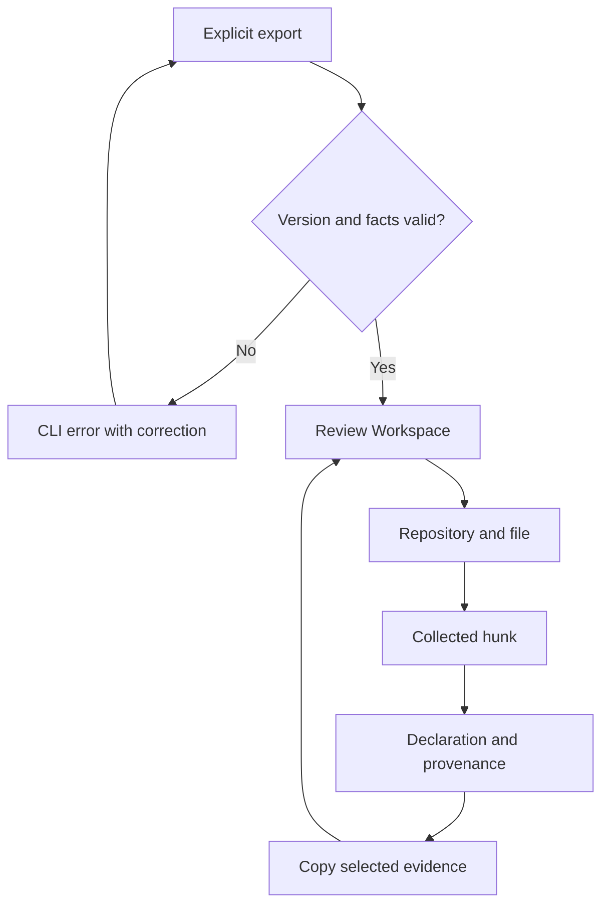
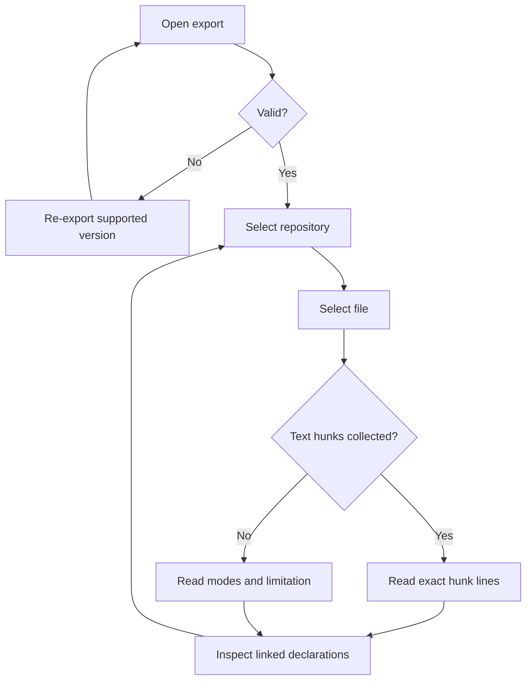
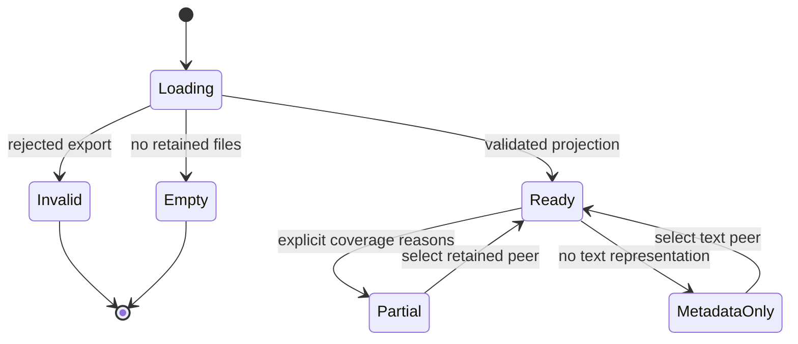
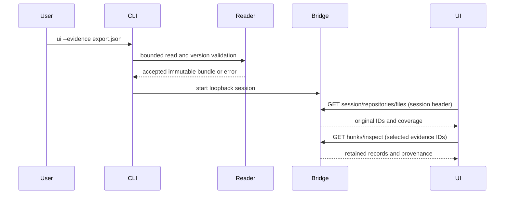
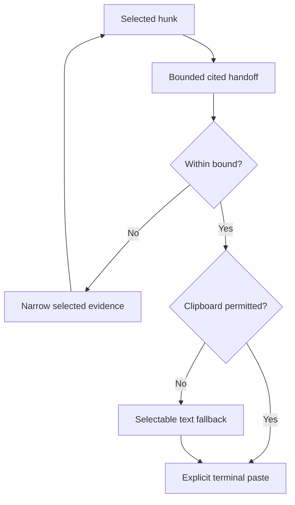
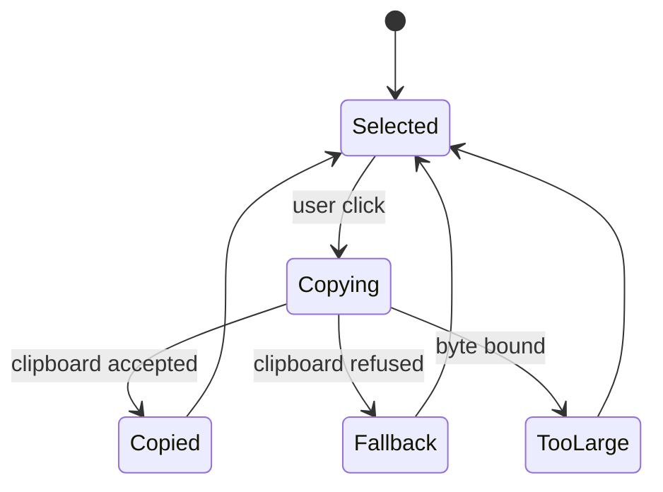
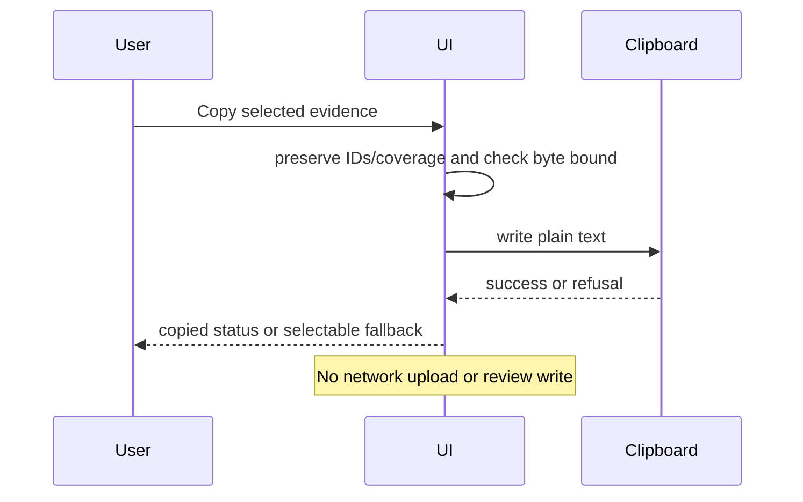

# Review Workspace use cases and navigation

The user's explicit continuation instruction authorizes these flows without a separate design approval round.

| ID | Actor / task | Preconditions | Main flow | Alternatives | Postcondition |
| --- | --- | --- | --- | --- | --- |
| UC-001 | Developer inspects exported changes | Explicit local export | Validate → open workspace → select repo/file → read hunks → inspect declarations/provenance | Invalid refuses startup; empty/partial/unsupported/binary/mode-only/historical state stays honest | Original captured evidence is visible; no workspace/state write |
| UC-002 | Developer hands evidence to a terminal agent | Selected retained evidence | Select hunk → copy evidence → paste explicitly in terminal | Bound exceeded: narrow selection; clipboard denied: selectable text | Cited plain data is available; no upload or acknowledgment |

## UC-001

## UC-002

## Wireframe inventory

| Screen | Purpose | Link | Outgoing navigation |
| --- | --- | --- | --- |
| Workspace | Chosen three-column reading/inspection | [workspace.html](wireframes/workspace.html) | wide layout, honest states |
| Wide workspace | Compare bottom inspector | [wide.html](wireframes/wide.html) | chosen workspace, honest states |
| States | Empty/partial/unsupported/binary/historical/invalid examples | [states.html](wireframes/states.html) | both layouts |

Each is synthetic, static and clickable. The same named layout regions/tokens carry into the working UI; fixture content is not a real exported integration result.
