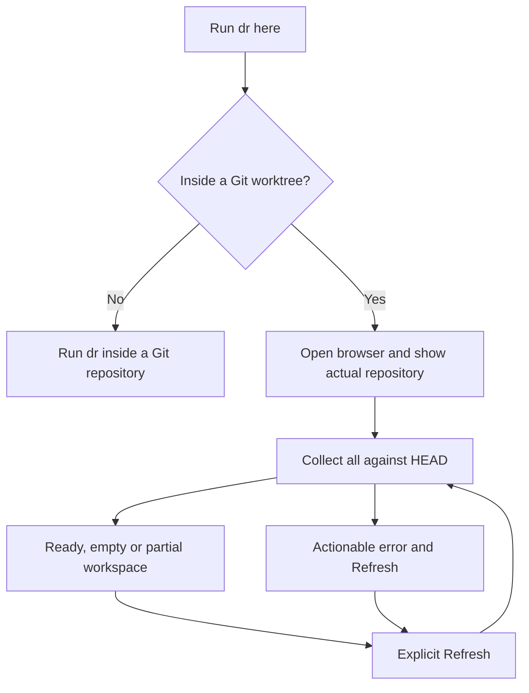
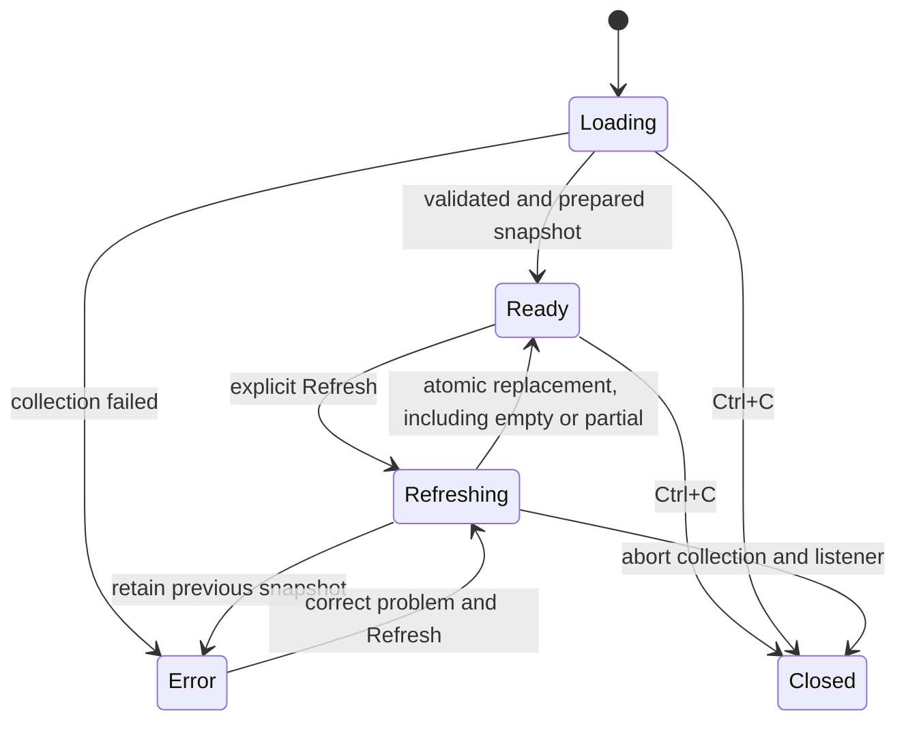
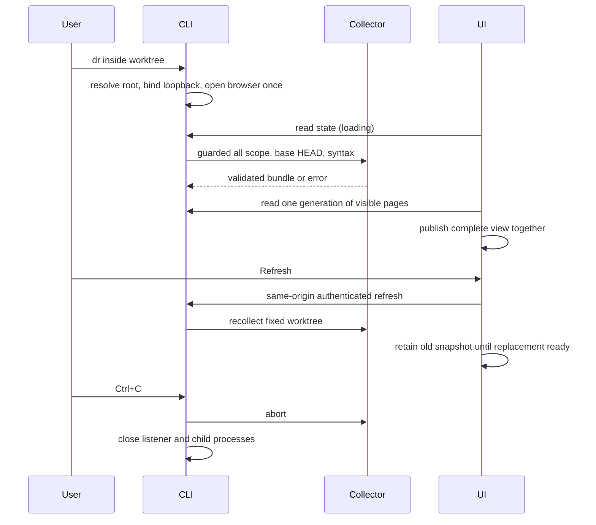
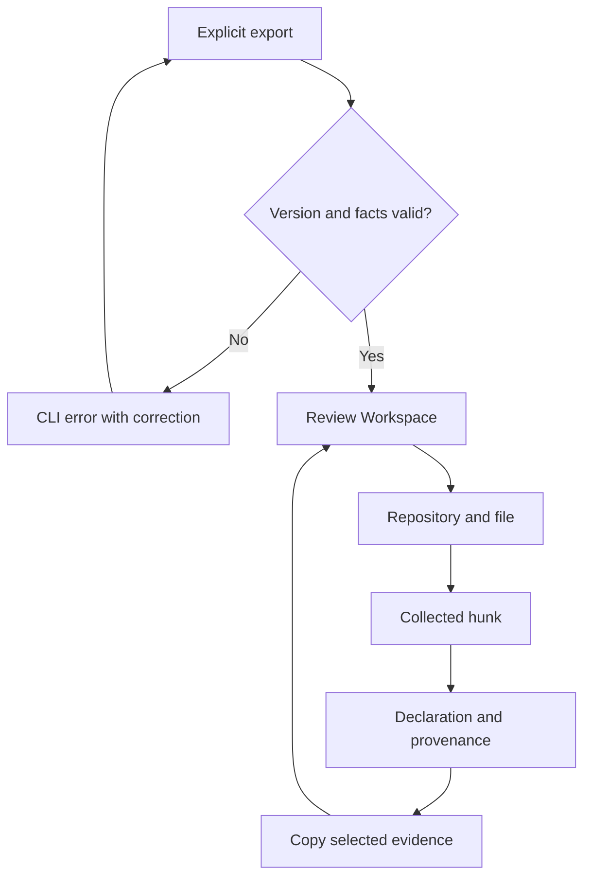
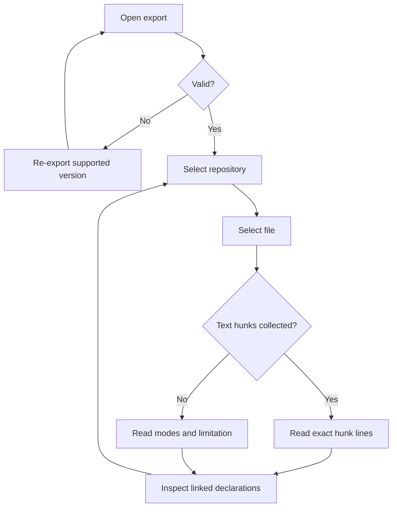
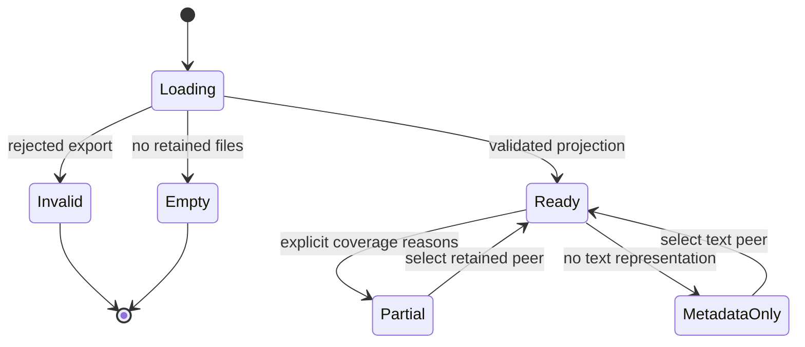
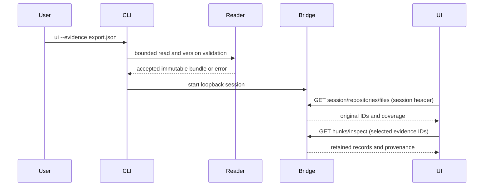
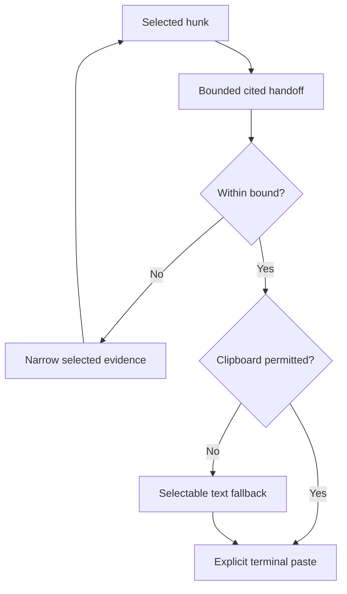
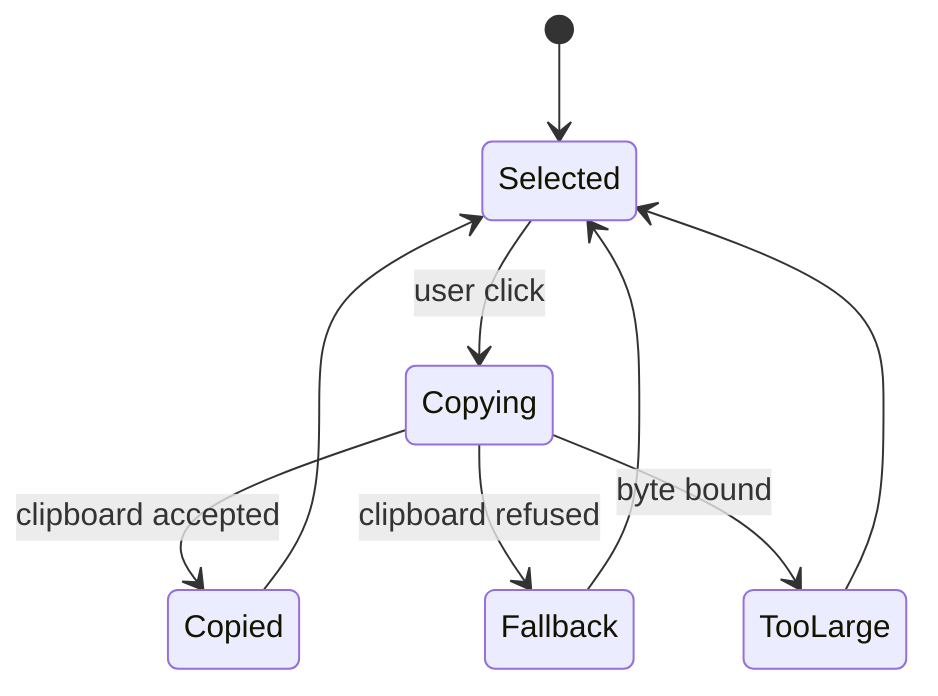
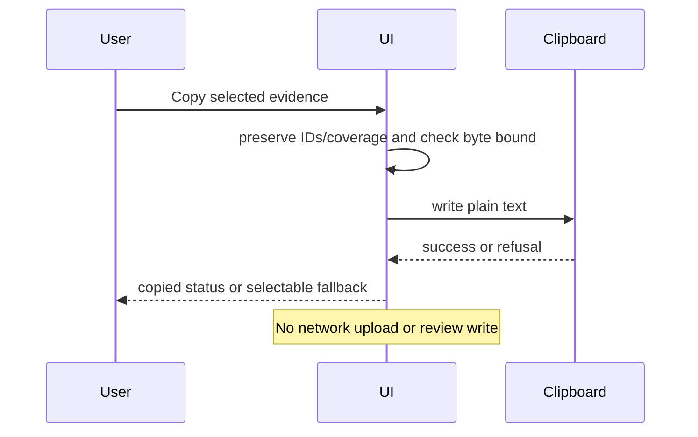

# Review Workspace use cases and navigation

The user's explicit continuation instruction authorizes these flows without a separate design approval round.

| ID | Actor / task | Preconditions | Main flow | Alternatives | Postcondition |
| --- | --- | --- | --- | --- | --- |
| UC-001 | Developer inspects exported changes | Explicit local export | Validate → open workspace → select repo/file → read hunks → inspect declarations/provenance | Invalid refuses startup; empty/partial/unsupported/binary/mode-only/historical state stays honest | Original captured evidence is visible; no workspace/state write |
| UC-002 | Developer hands evidence to a terminal agent | Selected retained evidence | Select hunk → copy evidence → paste explicitly in terminal | Bound exceeded: narrow selection; clipboard denied: selectable text | Cited plain data is available; no upload or acknowledgment |
| UC-003 | Developer opens current local changes | Inside a Git worktree with Git/Node installed | Run `dr` → browser opens → loading → collected workspace | Browser denied: terminal URL; outside Git: instruction; failed collection: correct problem and Refresh | One guarded `all` snapshot against HEAD; no remote or export required |
| UC-004 | Developer explicitly updates changes | Running local app | Refresh → retain current display → collect and validate → prepare all visible evidence → replace together | Partial replaces with honest coverage; failure retains last snapshot; concurrent Refresh disabled | File/path and unique hunk selection retained when applicable; no automatic acknowledgment |

## Local startup and Refresh design

The existing three-column workspace stays unchanged. A persistent repository strip shows the canonical worktree path, captured branch and `all · HEAD → working tree`, with a keyboard-accessible Refresh button. The first screen is useful before collection finishes: clear loading text, actual location and terminal lifetime. Empty means a complete collection with zero tracked net changes. Partial coverage and unborn HEAD are explained rather than presented as a clean result. Errors retain the last collected view and ask the user to correct the problem and Refresh. Browser launch failure prints the URL and keeps the server alive. Refresh is explicit; no watch mode, writes or review acknowledgments.

Reusable clickable wireframe: [local startup and refresh](wireframes/startup.html), linking to the existing workspace and states. Existing language/reading controls are preserved; no follow-up language or Bionic work is part of this change.

Screen map: terminal → loading → existing workspace (empty/partial/error variants); Refresh returns through loading while preserving the current view. Export viewing remains the separate existing explicit flow.

## UC-001

## UC-002

## Wireframe inventory

| Screen | Purpose | Link | Outgoing navigation |
| --- | --- | --- | --- |
| Workspace | Chosen three-column reading/inspection | [workspace.html](wireframes/workspace.html) | wide layout, honest states |
| Wide workspace | Compare bottom inspector | [wide.html](wireframes/wide.html) | chosen workspace, honest states |
| States | Empty/partial/unsupported/binary/historical/invalid examples | [states.html](wireframes/states.html) | both layouts |

Each is synthetic, static and clickable. The same named layout regions/tokens carry into the working UI; fixture content is not a real exported integration result.
